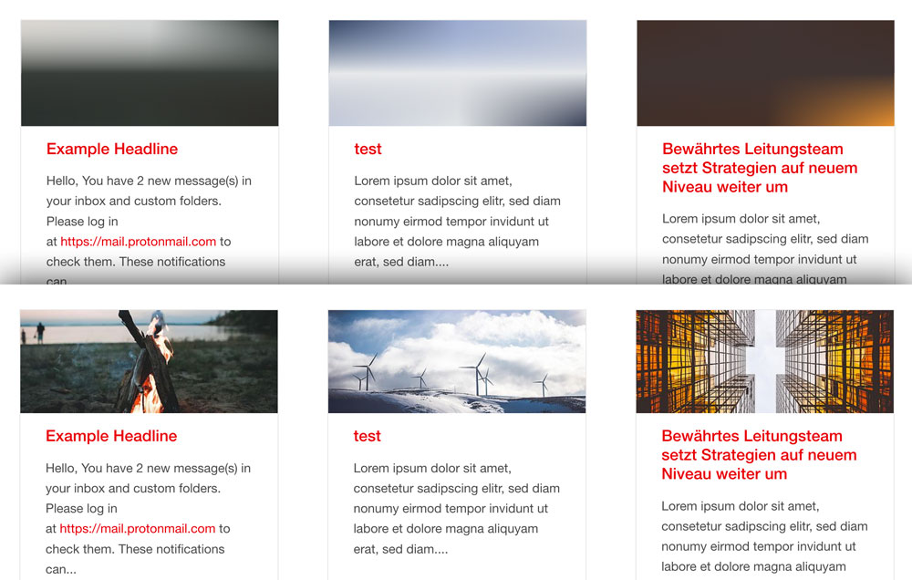

# TYPO3 Extension: Placeholder Images

Generates SVG inline placeholder images from FAL Media elements. The [Foundation Interchange plugin](https://foundation.zurb.com/sites/docs/interchange.html) is configured to resolve the right responsive image. The SVG placeholder consists of three gradients with 9 different colors from the original FAL image to make it look more natural.

The color extrection code is based on Frans Saris [lazy_load_placeholder](https://github.com/fsaris/lazy_load_placeholder) TYPO3 extension.
Lazy loading code inspired by [Mika Tuupola](https://appelsiini.net/projects/lazyload/). SVG inline compression is done like Taylor Hunt explained it in his [blog post](https://codepen.io/tigt/post/optimizing-svgs-in-data-uris).

## Requirements

- TYPO3 v8.0+
- Foundation 6 (or Foundation.Interchange Plugin)


## Installation

This extension is installable only via composer.

- ```composer require blueways/bw-placeholder-images```
- include TypoScript template

## Configuration

The Javascript File is automatically included via ```includeJSFooterLibs```. This can be disabled by unsetting

```
plugin.bw_placeholder_images.settings.placeholderImagesJS = EXT:bw_placeholder_images/Resources/Public/JavaScript/placeholderImages.js
```

## Useage

The color extraction starts automatically after uploading any ```jpg, jpeg, gif``` or ```png``` image via FAL.

### Viewhelper

Register the viewhelpers in any fluid template.

```
{namespace bw=Blueways\BwPlaceholderImages\ViewHelpers}
```
#### bw:lazyImage

This viewhelper acts like the normal ```<f:image />``` viewhelper, however there is an svg image output of the referenced ```src``` or ```image```. The final images are added via ```additionalAttributes``` in Foundation Interchange style.

Example with different crop variants:

```html
<bw:lazyImage
    image="{mediaElement}"
    cropVariant="small"
    width="585"
    additionalAttributes="{data-lazy-interchange: '
        [{f:uri.image(image:mediaElement,maxWidth:\'600\', cropVariant:\'small\')}, small],
        [{f:uri.image(image:mediaElement,maxWidth:\'500\', cropVariant:\'medium\')}, medium],
        [{f:uri.image(image:mediaElement,maxWidth:\'450\', cropVariant:\'large\')}, large]
    '}"
/>
```

#### bw:lazyPlaceholder

Acts like ```<f:uri.image />``` viewhelper.

Foundation Interchange can handle responsive background images, this viewhelper helps to generate the nessecary Output of an image resource path.

Example without crop variant and only one final image for all sizes:

```html
<div
    style='background-image: url("{bw:lazyPlaceholder(src:'{image.properties.uid}')}");'
    data-lazy-interchange="[{f:uri.image(src:'{image.properties.uid}', maxWidth:'640')}, small]"
></div>
```
Attention: The ```style=''``` Tag needs to be rendered with single quotes.


## TODO

* include dependencies in package
* make fallback color editable via typoscript
* animate image switch
